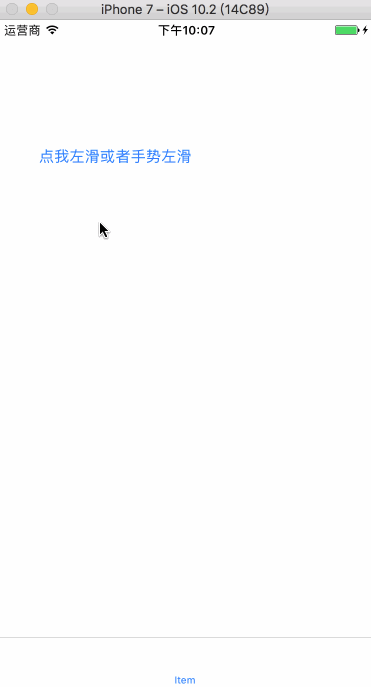

# DYLeftSlipManager

### 一行代码实现侧滑。完全解耦，两个界面之间不需要有任何耦合。基于控制器自定义转场。

使用：  

导入`#import "DYLeftSlipManager.h"  `

```iOS
// 注意这个控制器是右滑视图控制器，由于完全解耦，所以在DYLeftSlipManager内部是对该控制器强引用防止销毁。

LeftTableViewController *leftVC = [LeftTableViewController new];

[[DYLeftSlipManager sharedManager] setLeftViewController:leftVC coverViewController:self];

// 这个self是覆盖在右滑视图上层的控制器，一般应用中就是UITabBarController
```

嗯哼。是完全解耦的，你可以在任意地方调用这两句代码即可。

具体请看代码（好像也没有具体的了）。

实现思路：http://daiyi.pro/2017/03/12/DYLeftSlipManager_analysis/

相对于网上其他DEMO来说，本例是利用了控制器转场实现的，其他DEMO基本都是View上加侧滑View，这样的话两个界面之间耦合度太高，两个View都归一个C管，不能忍~~~本例就是两个控制器，各管各的业务。


